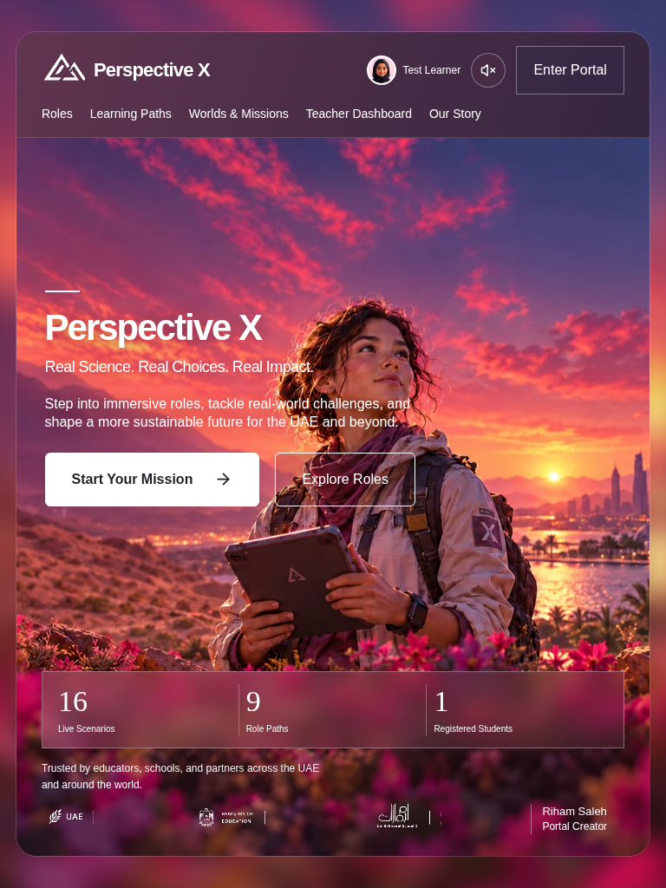

# Homepage soundtrack and account navigation review

Baseline: latest main, `61b1e0c7a0d9483178126a999efaca896a0bd107`.
Original review branch: `feat/homepage-soundtrack`, reviewed independently of Our Story PR #11. The authorized production release combines PRs #11–#13; see [release notes](../releases/2026-10-10-approved-updates.md).

## Implemented behavior

One homepage-owned audio element attempts playback on `/`, unless the visitor has manually muted music. A successful play fades to 15% over three seconds. The play request is unmuted at the intended audible level, so a zero-volume request is never used to evade the browser's autoplay decision. After permission succeeds, volume is reset to zero for the fade.

When playback is denied, the next trusted homepage pointer/keyboard interaction retries it. The speaker button starts or immediately mutes playback, persists the manual mute preference, and exposes actual playback state to assistive technology. Multiple attempts never create another player.

Native Web Locks provide exclusive ownership across same-origin tabs in the same browser profile. If another tab owns playback, this tab stays quiet. Browsers without Web Locks fail closed with an accessible unavailable state rather than risk overlapping sound. Mute preference changes propagate through local storage when available.

Hiding the tab pauses playback and releases ownership; visible/cached-page restoration re-reads the stored mute preference before any resume; returning attempts to resume only if manually unmuted and permitted by the browser. Navigation/unmount and pagehide immediately pause, silence and reset the element, cancel the fade, release ownership and abort/remove the media source. Pending play promises cannot leak sound onto another route or relinquish the lock while still starting.

The track loops natively with one stream. Its final second tapers toward silence, and the next loop fades in. Opening Our Story keeps the same player. There is no global sound provider and no change to mission audio, narration or videos.

The soundtrack requirements supersede the older ZIP's initially-off and 18% recommendations. The original delivery was Preview-only; the user subsequently authorized publishing all approved updates to the existing production site on October 10, 2026.

## Files

- `src/pages/Home.jsx`: mount one music control, remove Worlds & Missions, and replace Enter Portal with the signed-in visitor's own name/avatar account link.
- `src/components/landing/homepage.css`: homepage-only account sizing, including visible mobile names with ellipsis for long names.
- `src/components/landing/HomepageSoundtrack.jsx`: ownership, lifecycle and playback.
- `src/components/landing/homepage-soundtrack.css`: homepage-scoped icon control and accessible status.
- `public/audio/homepage/hopeful-cinematic-journey.mp3`: exact original downloaded asset, not re-encoded.
- `docs/homepage-music-license.md`, retrieval metadata and license excerpt: creator/source/licensing record.
- `tests/homepage-soundtrack*.spec.js`, `tests/support/homepageAudio.js`: playback coverage.
- `tests/approved-ui.spec.js`: guest sign-in and teacher/student account routing, plus the existing homepage style comparison.
- `tests/homepage-account.spec.js`: both roles' long names, selected avatars, accessible full names and header fit at desktop/tablet/mobile sizes.

## Account navigation update

Worlds & Missions and Enter Portal are removed for guests, teachers and students. One name/avatar link occupies the rightmost account position formerly occupied by Enter Portal and opens the user's appropriate dashboard. The existing Avatar component resolves the visitor's selected picture; no creator identity or fixed mockup avatar is substituted. Signed-out visitors retain a Sign In link. Start Your Mission keeps its existing authentication and dashboard routing.

Mobile names remain visible, with ellipsis when needed and a full accessible name/title. The approved header margin, blurred outer background, artwork and compact statistics are preserved. The music component and all internal pages are unchanged by this follow-up.

## Verification

- Account-header follow-up: build, lint and typecheck passed; all 27 relevant production-build browser checks passed. These cover guest sign-in, both roles' account/dashboard routing, long-name/avatar fit down to 354px, ten complete viewport sizes, homepage style isolation and all nine soundtrack checks. Music-status test selectors were scoped to the music component after the new account loading status exposed an ambiguous selector; playback code is unchanged.
- `npm run build`, `npm run lint`, `npm run typecheck`: passed, no lint failures.
- `npm run test:unit`: 9 passed.
- Initial full `npm run test:ui`: 82 passed, one old style-only test timed out waiting for network idle after audio was introduced. The readiness assumption was corrected and the affected test passed on rerun.
- Final production-build verification: 25 passed, including all nine soundtrack tests, the corrected style comparison, homepage guest/authenticated routing, statistics, and ten viewport-fit checks.
- After the final cached-page preference guard, build/lint/typecheck and all nine production-build soundtrack checks passed again.
- The exact bundled MP3 was probed at 113.580406 seconds and decoded by the browser. Native playback, nonzero PCM samples, 15% fade target and a real end-of-track loop were checked; no substitute or silent placeholder is used.
- Policy rejection and pending-play races use controlled failures/delays; successful playback and loops use the real MP3. Tab hiding is simulated through the visibility event, while cross-tab exclusivity uses real browser pages and Web Locks.
- Unsupported media, an actual missing-asset response, rapid toggles, preference persistence, late startup cancellation and immediate navigation reset were checked.
- Desktop/tablet/mobile screenshots reviewed at 1440 × 900, 768 × 1024 and 390 × 844.

Physical-device listening quality, native mobile-browser autoplay behavior and authenticated live Supabase QA remain unverified. The soundtrack/account changes preserve the homepage artwork, original hero typography and layout, dashboards, sign-in, scientific assessments and mission media. Header changes consist of the discreet music control and the requested account/navigation update. The production release also includes the separately approved Our Story dialog and teacher focus panel.

## Screenshots from the compiled app

See [license and original asset checksum](../homepage-music-license.md).

Vercel Preview uses the existing team sign-in protection (HTTP 302 to Vercel SSO). Deployment readiness is checked through Vercel/GitHub status; deployed-page browser playback QA is not claimed.
