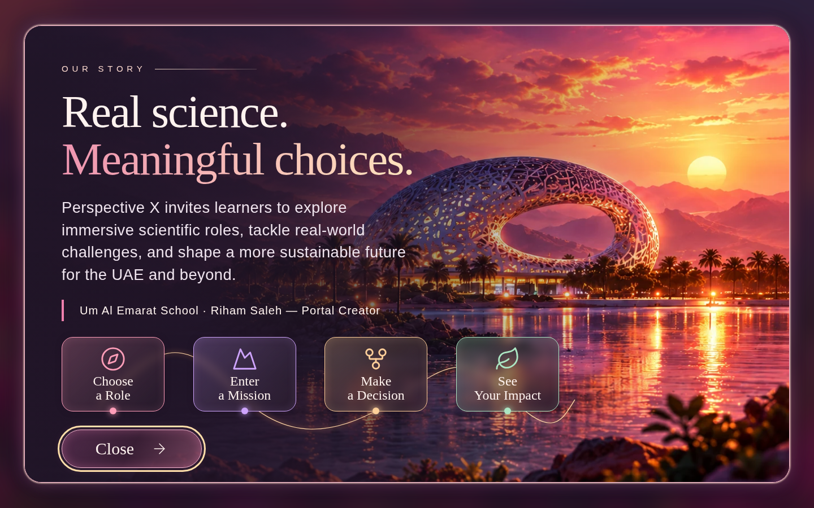
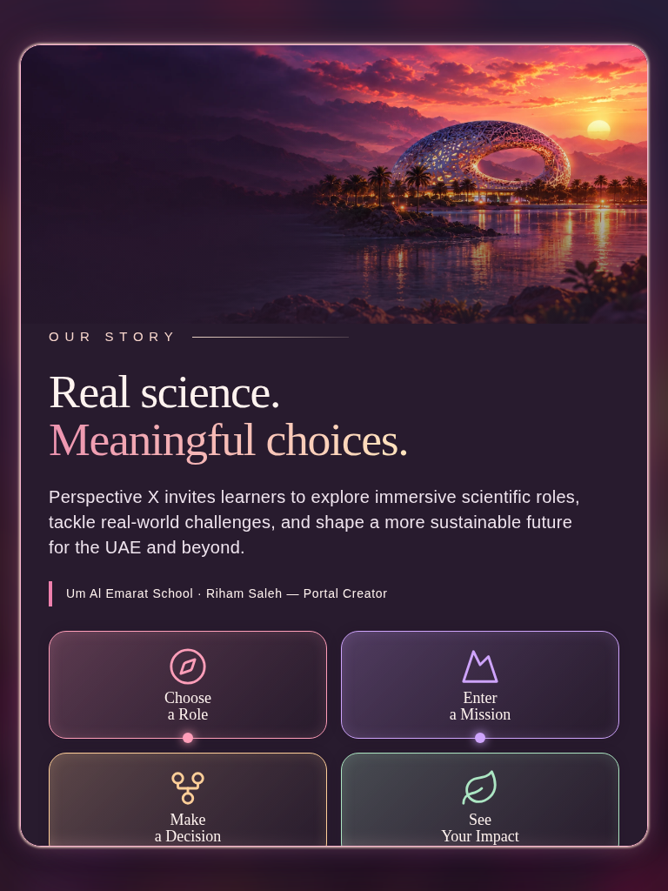
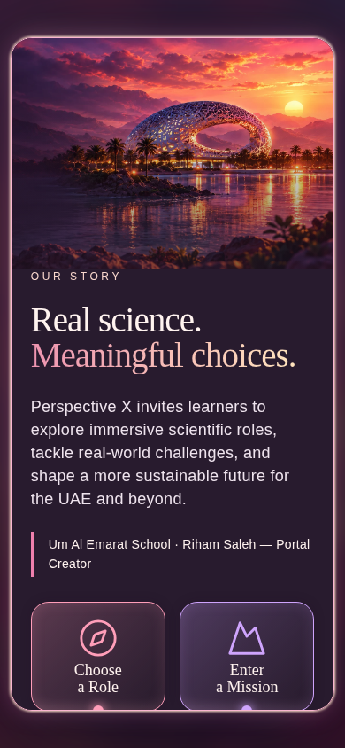
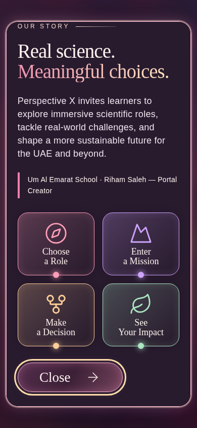

# Our Story review

Baseline: `61b1e0c7a0d9483178126a999efaca896a0bd107` (main).

The homepage Our Story trigger now opens a cinematic native dialog with live text, four informational journey cards, creator credit and Close button. Close and Escape restore trigger focus. Opening starts at the beginning of the story; smaller screens have internal scrolling and stacked scenery. Homepage layout, header clearance, blurred margins, statistics and other pages are preserved.

## Artwork

The original uploaded PNG is retained in `assets/OUR_STORY_APPROVED_REFERENCE.png` for comparison. Its SHA-256 matches the supplied manifest: `072e4b103a2654994984dde1bb695a772a308df377a1a260c087accfa881bdc9`.

The production artwork is an AI-assisted cleanup derived from that authorized reference, removing all baked-in typography, journey graphics, button and framing. It contains the Museum of the Future, sunset, palms and water, with no other landmarks or characters. It is a scenic recreation derived from the reference, not a claim of identical reference pixels. Live React elements render the interface independently.

Production asset: `public/images/perspective/our-story-museum.webp`, 1870 × 841, 181138 bytes, SHA-256 `17fe5e2a4f6b1772c190f3f34a33abfc75da13b6cc713f98de9d00b899e2b948`.

## Validation

- Build, lint and type check passed.
- Unit suite: 9 passed.
- Full browser suite: 77 passed; uses synthetic Supabase fixtures.
- After the final focus adjustment, production-build homepage and dialog checks: 14 passed.
- Dialog screenshots reviewed at 1440 × 900, 768 × 1024 and 390 × 844, including internal-scroll bottom views.
- Close/Escape, accessible naming, keyboard focus, initial scroll position, viewport bounds, text fidelity and absence of horizontal overflow checked.
- Exact screenshot equality before opening and after closing verifies restoration at all three dialog sizes.
- Existing homepage fit verified at ten viewport sizes. No changes to internal page source files, authentication or scientific assessments.
- Live authenticated Supabase QA remains unverified, per the user's synthetic-fixture instruction.

## Screenshots

